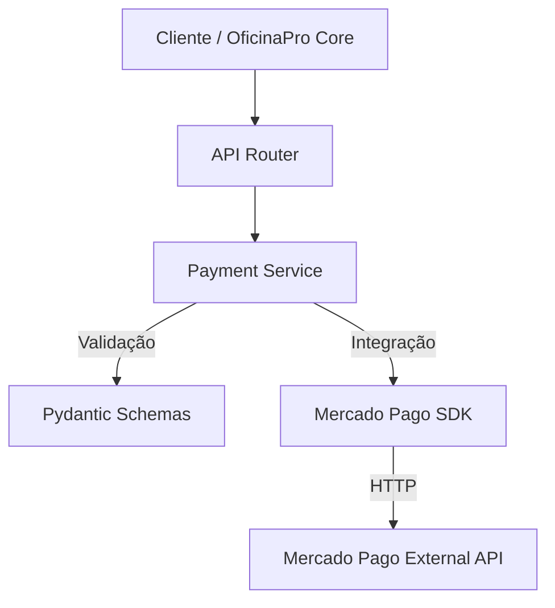

# Payment API (Python)

Esta é a API de Pagamentos desenvolvida para o Tech Challenge da Oficina Pro. Ela é responsável por processar pagamentos integrando com o Mercado Pago.

## 🚀 Tecnologias Utilizadas

- **Python 3.11+**
- **FastAPI**: Framework web moderno e de alto desempenho.
- **Mercado Pago SDK**: Integração oficial com o gateway de pagamento.
- **Pydantic**: Validação de dados.
- **Docker**: Containerização da aplicação.
- **GitHub Actions**: CI/CD.

## ⚙️ Configuração e Execução

### Pré-requisitos
- Docker instalado (Recomendado)
- OU Python 3.11+ e `pip`

### Variáveis de Ambiente
Crie um arquivo `.env` na raiz ou exporte as variáveis:
```bash
MP_ACCESS_TOKEN=seu_token_mercado_pago
```

### Executando com Docker (Recomendado)

1. Construir a imagem:
   ```bash
   docker build -t payment-api .
   ```

2. Rodar o container:
   ```bash
   docker run -p 8000:8000 --env-file .env payment-api
   ```

### Executando Localmente

1. Criar ambiente virtual:
   ```bash
   python -m venv venv
   source venv/bin/activate  # Linux/Mac
   # ou .\venv\Scripts\activate no Windows
   ```

2. Instalar dependências:
   ```bash
   pip install -r requirements.txt
   ```

3. Rodar a aplicação:
   ```bash
   uvicorn app.main:app --host 0.0.0.0 --port 8000 --reload
   ```

## 📚 Documentação da API

A documentação interativa (Swagger UI) está disponível automaticamente quando a aplicação está rodando:

- **Swagger UI**: [http://localhost:8000/docs](http://localhost:8000/docs)
- **ReDoc**: [http://localhost:8000/redoc](http://localhost:8000/redoc)

### Endpoints Principais

- `POST /api/v1/payments`: Cria um novo pagamento.
- `GET /api/v1/health`: Verifica saúde da API.

## 🏗️ Arquitetura

A API segue uma arquitetura limpa e modular:



- **Routers**: Definem as rotas HTTP.
- **Services**: Contém a regra de negócio e integração com o SDK.
- **Schemas**: Definem os contratos de dados (DTOs).

## 🧪 Testes

Para rodar o script de teste manual que verifica PIX, Boleto e Cartões:

```bash
python test_manual.py
```
Isso testará os fluxos de sucesso para PIX, Boleto, Crédito e Débito.

## 🔄 Integração

Para integrar com o backend principal Java:
1. Aponte o serviço Java para `http://payment-api:8000/api/v1`.
2. O payload esperado deve conter `order_id`, `amount`, `method`, `payer_email`, e dados específicos (como `card_data` para cartões ou `address` para boletos).
