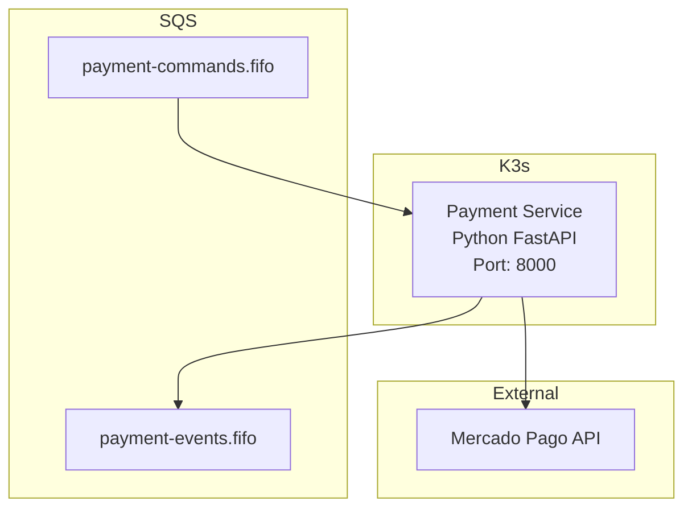

# OficinaPro Payments - Arquitetura e Documentação Técnica

> Serviço de Pagamentos via Mercado Pago (Python/FastAPI)  
> **Última atualização:** 18 de Fevereiro de 2026

---

## 🎯 Visão Geral

O **OficinaPro Payments** é o microserviço responsável por processar pagamentos através da API do Mercado Pago, encerrando o fluxo da saga de processamento de OS.

---

## 🏗️ Arquitetura AWS



---

## 🔄 Fluxo da Aplicação

### Processamento de Pagamento

```python
@router.post("/api/payments")
async def process_payment(payment: PaymentRequest):
    # 1. Validar billing
    billing = await validate_billing(payment.billing_id)
    
    # 2. Criar pagamento no Mercado Pago
    mp_payment = mercadopago_sdk.payment().create({
        "transaction_amount": billing.final_amount,
        "description": f"OS #{billing.order_id}",
        "payment_method_id": payment.payment_method,
        "payer": {
            "email": billing.customer_email
        }
    })
    
    # 3. Publicar evento
    if mp_payment["status"] == "approved":
        publish_event(PaymentCompletedEvent(payment_id=mp_payment["id"]))
    else:
        publish_event(PaymentFailedEvent(reason=mp_payment["status_detail"]))
```

---

## 📋 Regras de Negócio

### RN001: Métodos de Pagamento Aceitos

- ✅ PIX (instantâneo)
- ✅ Cartão de Crédito (parcelamento até 12×)
- ✅ Cartão de Débito
- ✅ Boleto Bancário (vencimento 3 dias)

### RN002: Parcelamento

| Valor | Parcelas Max | Juros |
|-------|--------------|-------|
| < R$ 100 | 1× | 0% |
| R$ 100-500 | 6× | 2,5% |
| R$ 500-2000 | 10× | 3,5% |
| > R$ 2000 | 12× | 4,5% |

### RN003: Timeout de Pagamento

- PIX: 10 minutos (QR Code expira)
- Cartão: 30 segundos (Mercado Pago)
- Boleto: 3 dias (vencimento)

---

## 💾 Modelo de Dados

Não possui banco próprio. Consulta Billing Service via HTTP para obter dados da fatura.

---

## 📊 Observabilidade

**Stack Python:**
- OpenTelemetry Python SDK
- Instrumentação automática FastAPI
- Logs estruturados JSON
- Métricas exportadas para New Relic

**Entity:** `oficinapro-payments`

---

## 🚀 Deployment

**Port:** 8000  
**Language:** Python 3.11 + FastAPI + Uvicorn  
**Image:** `ghcr.io/kbmarins/oficinapro-payments:latest`

**Env Vars:**
- `MERCADOPAGO_ACCESS_TOKEN` (secret)
- `SQS_PAYMENT_COMMANDS_QUEUE`
- `SQS_PAYMENT_EVENTS_QUEUE`

---

**Autor:** OficinaPro Team  
**Versão:** 1.0.0
